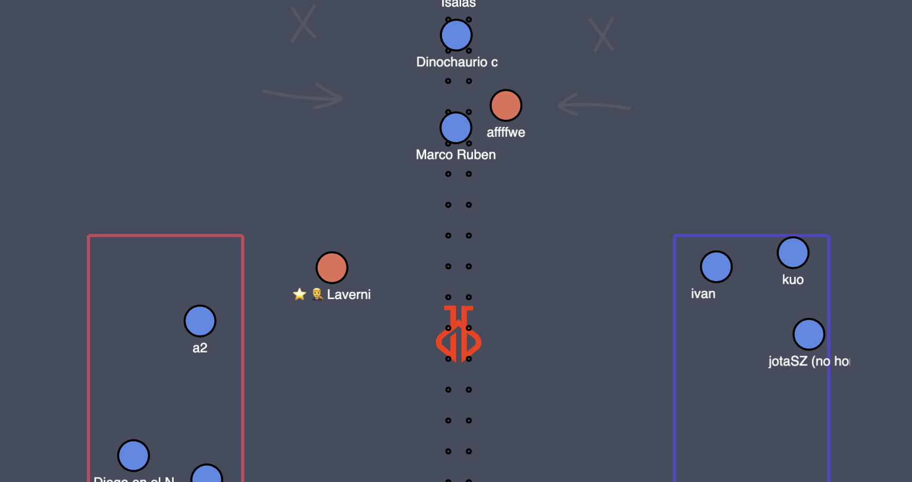

<h1 align="center">JJRS - Jakjus Real Soccer</h1>
<p>
  <a href="https://github.com/jakjus/hax-rs/blob/master/LICENSE" target="_blank">
    
  </a>
</p>

> Haxball Room Script for JJRS (Jakjus Real Soccer)



### 🚀 [Discord](https://discord.gg/Frg8Cr8UQb)

## Features

- [x] Real Soccer Map and Draft Map
- [x] Outs, Goal Kicks, Corners
- [x] Fouls, Yellow and Red cards
- [x] Free Kicks, Penalties
- [x] Offsides
- [x] Natural kicks (slight rotation)
- [x] Natural outs and ball passes
- [x] Slide, Sprint
- [x] Teamplay Bonus
- [x] ELO System (SQLite database)
- [x] Draft System - top ranked players choose their team
- [x] Fully automatic

## Prerequisites

- NPM
- NodeJS

## Install

```sh
git clone git@github.com:jakjus/jjrs.git
cd jjrs/
npm install
```

## Usage

Rename `config.example.ts` with `config.ts`. Insert **token** from https://haxball.com/headlesstoken into `config.ts`.

```ts
// config.ts

export default {
  roomName: `🌕   JJRS v1.2.0 by jakjus`,
  public: true,
  maxPlayers: 30,
  token: `YOUR_TOKEN_HERE`,
};
```

Run Server:

```sh
npm start
```

### How to play

When you pass within team, ball kicks get stronger, until enemy touches it. It promotes team play.
Hold and release KICK to activate superpower. Release on correct emoji to activate chosen power.

- 👟 Slide: Slide in chosen direction. If you touch an enemy player, he will be fouled.
- 💨 Sprint: Sprint in chosen direction
- 🩹 Call Foul: If you are fouled, you have short time to call foul by
  holding KICK. If you do not use it, the game goes on (privilege of
  benefit).

### Commands

_[NOTE] It is **not** intended do pause/stop/start games manually, as well as change
maps (also through using commands). Most of the time it works, but the script was not
designed to handle manual actions._

- `!login your_admin_pass` - login as admin. It allows you to use `!rs` and
  `!draft`
- `!draft` - start draft. Stopping it before end result may result in a
  in server crash.
- `!rs` - change map to Jakjus Real Soccer

### Settings

Some script settings can be changed in `src/settings.ts`. Also, if you
change RS map physics, you should update settings values in
`src/settings.ts`.

## Author

👤 **Jakub Juszko**

- Website: https://jakjus.com
- Github: [@jakjus](https://github.com/jakjus)
- LinkedIn: [@jakubjuszko](https://linkedin.com/in/jakubjuszko)

## 🤝 Contributing

This package is not published on NPM, because the script is self-contained and I do not expect anyone to
plug it into a bigger script.

Contributions, issues and feature requests are welcome!<br />Feel free to check [issues page](https://github.com/jakjus/hax-rs/issues).

## Show your support

Give a ⭐️ if this project helped you!

## 📝 License

Copyright © 2024 [Jakub Juszko](https://github.com/jakjus).<br />
This project is [MIT](https://github.com/jakjus/hax-rs/blob/master/LICENSE) licensed.

---
